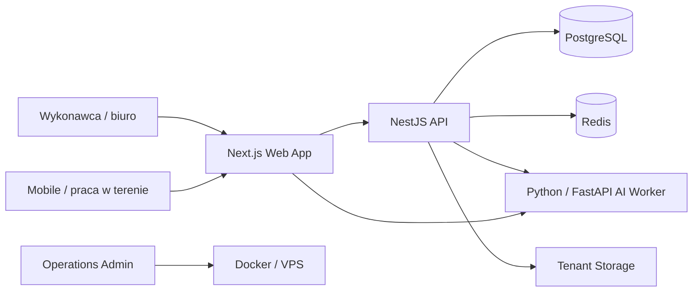

<p align="center">
  
</p>

<h1 align="center">Costor</h1>

<p align="center"><strong>SaaS do wycen, harmonogramów, finansów i obsługi procesów firm remontowo-budowlanych.</strong></p>

<p align="center">
  <a href="https://costor.eu">costor.eu</a>
</p>

**English summary:** Costor is my original SaaS product for construction and renovation companies, combining field data collection, estimating, scheduling, finance and AI-assisted document workflows in one operational system.

Costor to mój autorski produkt SaaS dla małych firm remontowo-budowlanych. Łączy zbieranie danych w terenie, wyceny, harmonogramy, finanse i przetwarzanie dokumentów wspomagane przez AI w jednym workflow operacyjnym.

> To publiczne repozytorium pokazowe. Kod produkcyjny, konfiguracja infrastruktury i sekrety są przechowywane prywatnie.

## Podgląd produktu

<p align="center">
  
</p>

### Pulpit operacyjny

Pulpit daje wykonawcy jedno miejsce do kontroli wycen, dokumentów, terminów i spraw wymagających uwagi.

<p align="center">
  
</p>

### Wyceny

W Costorze wycena jest centralnym obiektem operacyjnym. Materiał może być zebrany w terenie, przetworzony z pomocą AI, a następnie zweryfikowany i dopracowany na desktopie.

<table>
<tr>
<td width="50%"></td>
<td width="50%"></td>
</tr>
<tr>
<td align="center"><strong>Lista wycen</strong></td>
<td align="center"><strong>Szczegóły wyceny</strong></td>
</tr>
</table>

### Finanse i dokumenty

Aplikacja łączy wyceny z dalszym workflow finansowym: kosztami, dokumentami sprzedażowymi, należnościami i płatnościami.

<table>
<tr>
<td width="50%"></td>
<td width="50%"></td>
</tr>
<tr>
<td align="center"><strong>Koszty</strong></td>
<td align="center"><strong>Płatności</strong></td>
</tr>
</table>

### Portal klienta

<p align="center">
  
</p>

## Idea produktu

Małe firmy remontowo-budowlane często pracują jednocześnie na arkuszach, komunikatorach, papierowych notatkach, zdjęciach, PDF-ach i programach księgowych.

Costor ma zebrać ten chaos w jeden system oparty o wycenę jako centralny obiekt biznesowy.

Główny przepływ:

`dane z terenu → wycena → zaakceptowany zakres → harmonogram → finanse → dokumenty sprzedażowe`

## Główne możliwości

- wyceny remontowo-budowlane,
- mobilne zbieranie danych w terenie,
- wymiary pomieszczeń, zdjęcia, opisy i notatki głosowe,
- przygotowanie wyceny wspomagane przez AI,
- cennik i walidacja cen,
- harmonogramy prac i planowanie ekip,
- kontrola sprzedaży i kosztów,
- należności i płatności,
- przetwarzanie dokumentów ze zdjęć i PDF,
- billing abonamentowy,
- panel administracyjny i operacyjny,
- health checki, monitoring i workflow wdrożeniowy.

## Architektura



## Stack technologiczny

**Frontend**  
`Next.js` · `React` · `TypeScript` · `Tailwind CSS`

**Backend**  
`NestJS` · `TypeScript` · `Prisma` · `PostgreSQL`

**Warstwa AI**  
`Python` · `FastAPI` · `OpenAI API`

**Infrastruktura**  
`Docker` · `Redis` · `Linux` · `VPS` · `Nginx Proxy Manager`

## AI w Costorze

AI jest warstwą wspomagającą, a nie źródłem prawdy dla krytycznych obliczeń.

Typowe zadania AI:

- interpretacja notatek terenowych i transkrypcji głosowych,
- rozpoznawanie prac na podstawie zebranego materiału,
- przygotowanie szkicu wyceny,
- audyt pozycji cennika,
- wsparcie generowania harmonogramu,
- przetwarzanie dokumentów i załączników,
- diagnostyka operacyjna.

Krytyczne ilości, dni robocze, sumy i reguły biznesowe są walidowane deterministycznie przez aplikację.

## Model estimate-first

Costor jest rozwijany w podejściu **estimate-first**.

Wycena, harmonogram i finanse nie są traktowane jako niezależne moduły. Zaakceptowana wycena staje się podstawą kolejnych procesów.

```text
Wycena
  ↓
Zaakceptowany zakres
  ↓
Harmonogram
  ↓
Realizacja
  ↓
Koszty / płatności / dokumenty
```

Dzięki temu system jest bliższy rzeczywistemu sposobowi pracy małej firmy budowlanej niż zestaw niezależnych formularzy.

## Workflow terenowy

Mobilny workflow służy do szybkiego zebrania informacji bezpośrednio na budowie:

1. Utworzenie lub otwarcie wyceny.
2. Dodanie pomieszczeń / obszarów prac.
3. Wprowadzenie podstawowych wymiarów.
4. Dodanie zdjęć, opisów i notatek głosowych.
5. Ustawienie parametrów konkretnej wyceny.
6. Wygenerowanie wspomaganego szkicu.
7. Weryfikacja i korekta na desktopie.
8. Akceptacja finalnego zakresu.

AI nie zgaduje podstawowych wymiarów pomieszczenia bez wiarygodnej skali. Dane podane przez użytkownika pozostają głównym źródłem krytycznych wymiarów.

## Operacje biznesowe

Costor nie jest tylko kalkulatorem wycen. Obejmuje również procesy wokół wyceny:

- klientów,
- cenniki,
- harmonogramy,
- koszty,
- należności,
- płatności częściowe,
- dokumenty sprzedażowe,
- dostęp abonamentowy,
- diagnostykę administracyjną.

## Infrastruktura produktu

System produkcyjny działa kontenerowo na VPS.

Architektura obejmuje m.in.:

- odseparowane usługi aplikacyjne,
- PostgreSQL,
- Redis,
- storage tenantów,
- AI workera,
- reverse proxy,
- health checki,
- monitoring,
- smoke testy po wdrożeniu,
- osobne środowisko nieprodukcyjne do walidacji zmian.

Szczegóły produkcyjnej infrastruktury i dane dostępowe nie są publikowane w tym repozytorium.

## Zasady projektowe

**Najpierw proces biznesowy**  
Aplikacja ma odwzorowywać sposób pracy wykonawcy zamiast zmuszać go do generycznego workflow.

**AI wspomaga, software waliduje**  
AI może interpretować i proponować. Krytyczne obliczenia i przejścia stanów kontroluje logika aplikacji.

**Jedno źródło danych operacyjnych**  
Wycena łączy późniejsze procesy harmonogramu i finansów.

**Mobile do zbierania danych, desktop do kontroli**  
W terenie liczy się szybkość, natomiast szczegółowa weryfikacja pozostaje dostępna w głównej aplikacji.

**System musi być obserwowalny i wdrażalny**  
Monitoring, health checki i procedury deploymentu są traktowane jako część produktu.

## Status produktu

Costor jest aktywnie rozwijanym produktem.

Prywatne repozytorium produkcyjne zawiera kod aplikacji, definicje infrastruktury, procedury wdrożeniowe i dokumentację operacyjną. To publiczne repo pokazuje produkt, architekturę i podejście inżynierskie bez ujawniania wrażliwych elementów produkcji.

## Autor

Costor został zaprojektowany i jest rozwijany przez **Piotra Nowackiego / SoftCode**.

Tworzę dedykowane systemy biznesowe, produkty SaaS i oprogramowanie wspomagane przez AI.

**Strona:** [softcode-ai.pl](https://softcode-ai.pl)  
**Produkt:** [costor.eu](https://costor.eu)

---

### Zakres repozytorium

To jest **repozytorium showcase**, a nie repozytorium kodu produkcyjnego.

Nie publikuję tutaj danych klientów, sekretów, kluczy API ani prywatnej konfiguracji infrastruktury.
