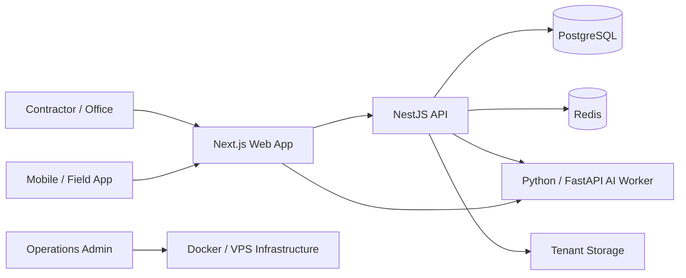

<p align="center">
  
</p>

<h1 align="center">Costor</h1>

<p align="center"><strong>SaaS for construction cost estimation and business operations.</strong></p>

<p align="center">
  <a href="https://costor.eu">costor.eu</a>
</p>

Costor is my original SaaS product for small construction and renovation companies. It connects field data collection, estimating, scheduling, finance and AI-assisted document processing in one operational workflow.

> This repository is a public product showcase. The production source code, infrastructure configuration and secrets are kept private.

## Product preview

<p align="center">
  
</p>

### Operational dashboard

The dashboard gives the contractor one place to see estimates, documents, deadlines and the items that require attention.

<p align="center">
  
</p>

### Estimates

Costor treats the estimate as the central operational object. Field material can be collected on mobile, processed with AI assistance and then reviewed and finalized on desktop.

<table>
<tr>
<td width="50%"></td>
<td width="50%"></td>
</tr>
<tr>
<td align="center"><strong>Estimate workspace</strong></td>
<td align="center"><strong>Estimate details</strong></td>
</tr>
</table>

### Finance and documents

The application connects estimates with the financial workflow: sales documents, costs, receivables and payments.

<table>
<tr>
<td width="50%"></td>
<td width="50%"></td>
</tr>
<tr>
<td align="center"><strong>Costs</strong></td>
<td align="center"><strong>Payments</strong></td>
</tr>
</table>

### Client portal

<p align="center">
  
</p>

## Product idea

Small contractors often work across spreadsheets, messaging apps, paper notes, photos, PDFs and accounting tools. Costor is designed to bring those fragmented workflows into one system built around the estimate as the central business object.

The core flow is:

`field data → estimate → accepted scope → schedule → financial control → sales documents`

## Main capabilities

- Construction and renovation estimates
- Mobile field data collection
- Room dimensions, photos, descriptions and voice input
- AI-assisted estimate preparation
- Price book and pricing validation
- Work schedules and crew planning
- Sales and cost tracking
- Payment and receivables tracking
- Document processing from photos and PDFs
- Subscription billing
- Administrative and operational tooling
- Health checks, monitoring and deployment workflows

## Architecture



## Technology stack

**Frontend**  
`Next.js` · `React` · `TypeScript` · `Tailwind CSS`

**Backend**  
`NestJS` · `TypeScript` · `Prisma` · `PostgreSQL`

**AI layer**  
`Python` · `FastAPI` · `OpenAI API`

**Infrastructure**  
`Docker` · `Redis` · `Linux` · `VPS` · `Nginx Proxy Manager`

## AI in Costor

AI is used as an assisting layer, not as the source of truth for critical calculations.

Typical AI tasks include:

- interpreting field notes and voice transcriptions,
- recognizing work items from collected material,
- preparing estimate drafts,
- auditing price-book entries,
- assisting with schedule generation,
- processing documents and attachments,
- supporting operational diagnostics.

Critical quantities, working days, totals and business rules are validated deterministically by the application.

## Estimate-first model

Costor is built around an **estimate-first** approach.

Instead of treating estimating, scheduling and finance as unrelated modules, an accepted estimate becomes the basis for later operational steps.

```text
Estimate
  ↓
Accepted scope
  ↓
Work schedule
  ↓
Execution
  ↓
Costs / payments / documents
```

This makes the system closer to the real workflow of a small construction company than a collection of independent forms.

## Field workflow

The mobile workflow is designed for collecting information directly on site:

1. Create or open an estimate.
2. Add rooms / work areas.
3. Enter base dimensions.
4. Add photos, descriptions and voice notes.
5. Set estimate-specific parameters.
6. Generate an assisted estimate draft.
7. Review and correct it on desktop.
8. Accept the final scope.

AI does not guess basic room dimensions without a reliable scale. User-provided measurements remain the primary source for critical dimensions.

## Business operations

Costor is not only an estimating calculator. The product also covers operational areas around the estimate, including:

- client management,
- price books,
- scheduling,
- costs,
- receivables,
- partial payments,
- sales documents,
- subscription access,
- administrative diagnostics.

## Product infrastructure

The production system is containerized and runs on VPS infrastructure.

The architecture includes:

- isolated application services,
- PostgreSQL,
- Redis,
- tenant storage,
- AI worker,
- reverse proxy,
- health checks,
- monitoring,
- post-deployment smoke tests,
- separate non-production environment for validation.

Production implementation details and credentials are intentionally not published in this showcase repository.

## Design principles

**Business process first**  
The application follows the contractor's workflow instead of forcing the user into generic software patterns.

**AI assists, software validates**  
AI may interpret or propose. Critical calculations and state transitions are validated by application logic.

**One source of operational data**  
The estimate connects later scheduling and financial processes.

**Mobile data collection, desktop control**  
The field workflow is optimized for quick collection, while detailed verification remains available in the main application.

**Deployable and observable**  
Monitoring, health checks and deployment procedures are treated as part of the product, not as an afterthought.

## Product status

Costor is an actively developed product.

The private production repository contains the application code, infrastructure definitions, deployment procedures and operational documentation. This public repository exists to present the product architecture, engineering approach and selected capabilities without exposing production-sensitive material.

## About the author

Costor is designed and developed by **Piotr Nowacki / SoftCode**.

I build custom business systems, SaaS products and AI-assisted operational software.

**Website:** [softcode-ai.pl](https://softcode-ai.pl)  
**Product:** [costor.eu](https://costor.eu)

---

### Repository scope

This is a **showcase repository**, not the production source repository.

No client data, production credentials, API secrets or private infrastructure configuration are published here.
